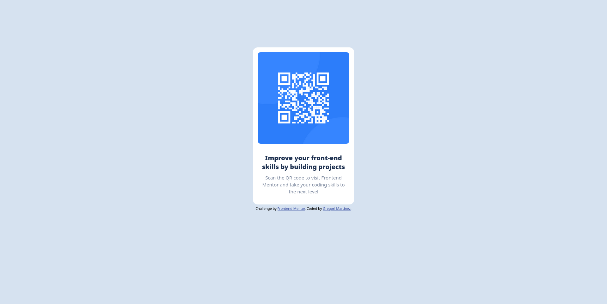

# Frontend Mentor - QR code component solution

This is my solution to the [QR code component challenge on Frontend Mentor](https://www.frontendmentor.io/challenges/qr-code-component-iux_sIO_H). Frontend Mentor challenges help you improve your coding skills by building realistic projects. 

## Table of contents

- [Overview](#overview)
  - [Screenshot](#screenshot)
  - [Links](#links)
- [My process](#my-process)
  - [Built with](#built-with)
  - [What I learned](#what-i-learned)
- [Author](#author)

## Overview

### Screenshot

Added a screenshot of my solution. As you can see, this is the closer I got to the given design.

### Links

- Solution URL: [This is the solution](https://github.com/GregoriM04/qr-code-component)
- Live Site URL: [Link to live site](https://gregorim04.github.io/qr-code-component/)

## My process

I first started umdertanding the guidelines given in Frontend Mentor's page, the I organized the corresponding files to begin with the challenge. So, I first wrote the structure of the Html file, then I created the css folder container, and later I began with the style file. Once I finish with the css stylesheet, I check the detaits of every part and made myself to be sure of what I did.

### Built with

- Semantic HTML5 markup
- CSS custom properties
- Flexbox
- Mobile-first workflow

### What I learned

I have learned that in some cases simpler is better; but that does not mean to forget about the details. So, it's important to meet a good balance between simplicity and lushness when designing.

## Author

- LinkedIn - [Gregori Martinez](https://www.linkedin.com/in/gregorim04/)
- Frontend Mentor - [@GregoriM04](https://www.frontendmentor.io/profile/GregoriM04)
- Twitter - [@GregoriM04](https://www.twitter.com/yourusername)